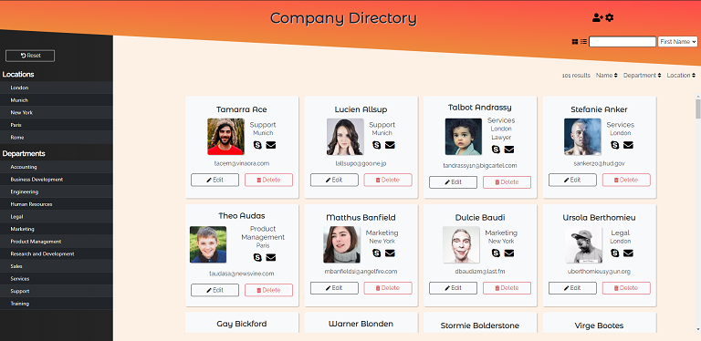

# Company Directory
companydirectory.kateeliza.co.uk

## Introduction
Created in January 2021, this project was one of the training requirements for the IT Career Switch course. 
The brief specified that the application must provide an employee management system to see who worked in which department/location, and to provide a database management interface for adding and removing staff, changing their details and updating departments and locations.  
This was designed mobile-first, but scales to larger screens.  
I also used this project to practice using GitHub desktop, creating branches and pull requests for each feature added. 

## Technologies Used
* HTML
* CSS/Bootstrap
* Javascript/jQuery
* PHP
* SQL + MySQL

## Screenshots

